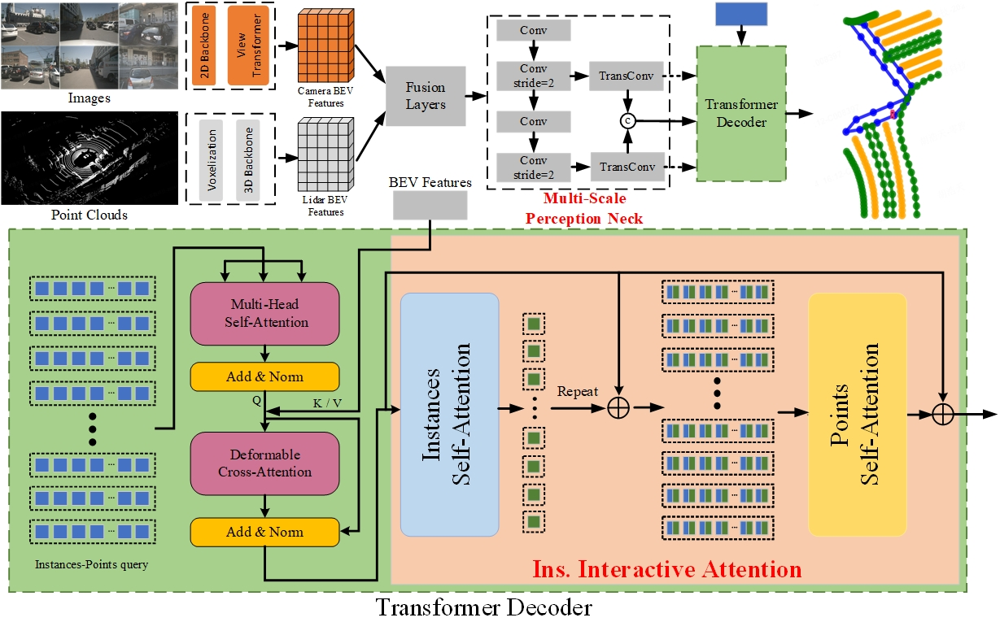
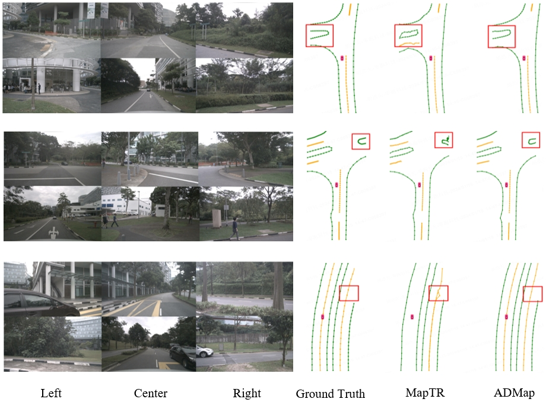
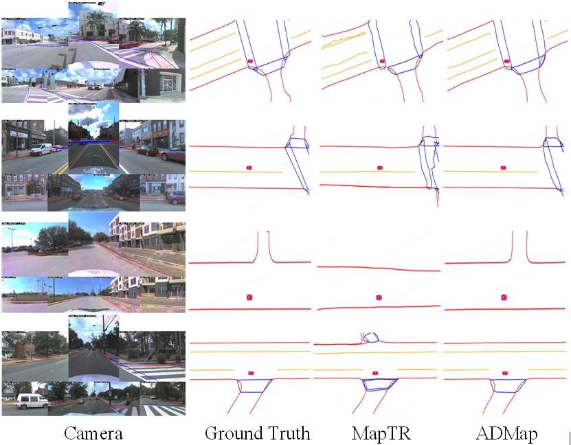

# ADMap: Anti-disturbance framework for reconstructing online vectorized HD map
Due to confidentiality rules, the open source code is extra reproducible. If it doesn't work correctly, ask a question in the issue and we'll fix the problem as soon as possible.
## New
+ **2024.1.22**   create README.md

## Abstract
In the field of autonomous driving, online high-definition (HD) map reconstruction is crucial for planning tasks. Recent research has developed several high-performance HD map reconstruction models to meet this necessity. However, the point sequences within the instance vectors may be jittery or jagged due to prediction bias, which can impact subsequent tasks. Therefore, this paper proposes the Anti-disturbance Map (ADMap) framework. To mitigate point-order jitter, the framework consists of three modules: Multi-Scale Perception Neck, Instance Interactive Attention (IIA), and Vector Direction Difference Loss (VDDL). By exploring the point-order relationships between and within instances in a cascading manner, the model can monitor the point-order prediction process more effectively. We confirmed the validity of ADMap in both nuScenes and Argoverse2, demonstrating its excellent performance.

 

### [paper]()

## Main Result
### nuScenes val
| Method                 | Backbone                                            | $AP_{div}$       |  $AP_{ped}$        |  $AP_{bou}$        | mAP        | FPS        |
| :----------------------: | :---------------------------------------------------: | :----------: | :----------: | :----------: | :----------: | :----------: |
| MapTR    | R50 | 51.5       | 46.3      | 53.1     | 50.3    | 15.1 |
| **ADMap**  | R50 | **56.2**     | **49.4**    | **57.9**    | **54.5**    | **14.8**    |
| MapTR    | R50 & SECOND | 55.9       | 62.3      | 69.3      | 62.5      | 6.0    |
| **ADMap**   | R50 & SECOND | **66.6**     | **63.3**    | **74.0**    | **68.0**    | **5.8**    |
| MapTRv2  | R50 & SECOND | 65.6      | 66.5     | 74.8   | 69.0   | 5.8  |
| **ADMapv2**  | R50 & SECOND   | **67.9**     | **68.5**    | **74.5**    | **70.3**    | **6.1**    |
-   FPS is measured on NVIDIA RTX3090 GPU with batch size of 1.

### Argoverse2 val
| Method                 | Backbone                                            | $AP_{div}$       |  $AP_{ped}$        |  $AP_{bou}$        | mAP        | FPS        |
| :----------------------: | :---------------------------------------------------: | :----------: | :----------: | :----------: | :----------: | :----------: |
| MapTR    | R50 | 65.5       | 56.6      | 61.8     | 61.3    | 14.8 |
| **ADMap**  | R50 | **68.9**     | **60.3**    | **64.9**    | **64.7**    | **14.2**    |
| MapTRv2  | R50 & SECOND | 62.9      | 72.1     | 67.1   | 67.4   | 12.0  |
| **ADMapv2**  | R50 & SECOND   | **72.4**     | **64.5**    | **68.9**    | **68.7**    | **13.9**    |

-   FPS is measured on NVIDIA RTX3090 GPU with batch size of 1.

### Visualization results
#### nuScenes Visualization

#### Argoverse2 Visualization

## Acknowlegement
We sincerely thank the authors of [MapTR](https://github.com/hustvl/MapTR) for open sourcing their methods.
